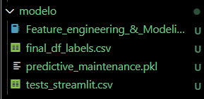
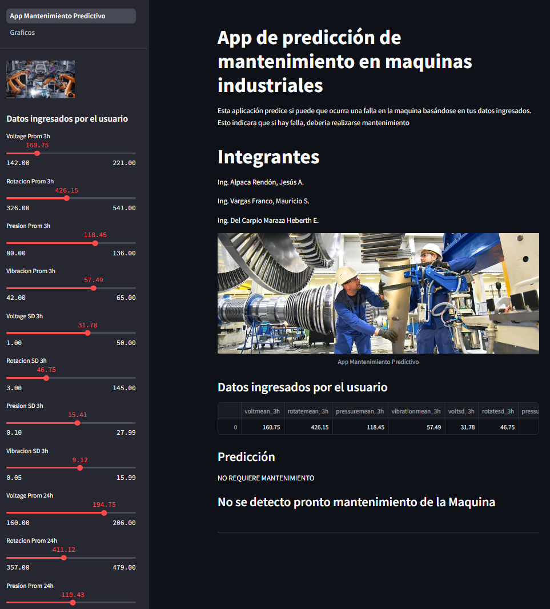

# APP DE MANTENIMIENTO PREDICTIVO DE MAQUINAS

Proyecto final del curso de Recuperacion de Informacion de la Universidad Nacional San Agustin de Arequipa.

## Integrantes

* Ing. Alpaca Rendón, Jesús A.
* Ing. Del Carpio Maraza Heberth E.
* Ing. Vargas Franco, Mauricio S.

## Descripcion

Proyecto sobre la creacion de un articulo donde se realiza el analisis de datos y transformacion de datos sobre maquinas industriales donde se tienen registros de errores, partes, metricas para poder generar un modelo de ML sobre un mantenimiento predictivo.

## Contenido

El repositorio contiene:

* Carpetas:
    - analisis: Contiene el analisis de datos
    - assets: Datos de media para el dashboard web
    - data: incluye el csv transformado y unificado y dentro la carpeta dataset donde encontraremos el dataset original
    - documentos: Encontraremos el articulo en Word y PDF
    - modelo: Encontraremos la ingenieria de caracteristicas y el entrenamiento del modelo
    - pages: pagina adicional al dashboard que contiene KPIs

* Archivos:
    - App_Mantenimiento_Predictivo.py: Ejecutable del Dashboard acomplado con el modelo entrenado
    - requirements.txt: lista de librerias a instalar en el ambiente de Python
    - README.md: archivo actual

## Inicio

Para iniciar, se debe ejecutar con "pip" o "conda" las librerias a instalar del requirements.txt, podemos utilizar los comandos:

```bash
  pip install -r requirements.txt
```
o con conda:

```bash
  conda install --file requirements.txt
```

### Pasos
1. Iniciar con la ejecucion del modelo en Jupiter *Feature_engineering_&_Modeling.py*
2. Al final generara los 3 archivos necesarios para el dashboard:

    

3. Colocar el *final_df_labels.csv* y el archivo *predictive_maintenance.pkl* dentro de la carpeta "data", el primero sera el dataset transformado y el segundo archivo es el modelo entrenado exportado en archivo .pkl
4. Ejecutar el comando
```bash
    python App_Mantenimiento_Predictivo.py
```
5. Una vez compilado, ejecutamos ahora el comando:
```bash
    streamlit run .\App_Mantenimiento_Predictivo.py
```
6. Levantara el dashboard de manera local, donde ya podemos ingresar datos y validar el modelo predictivo.

